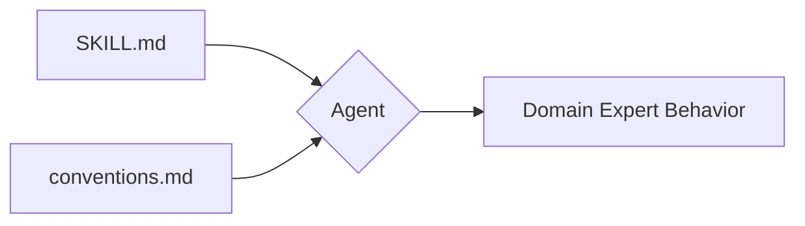
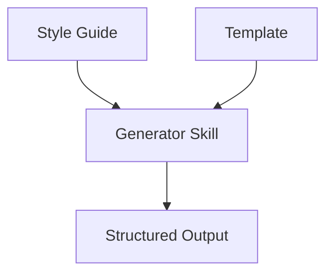
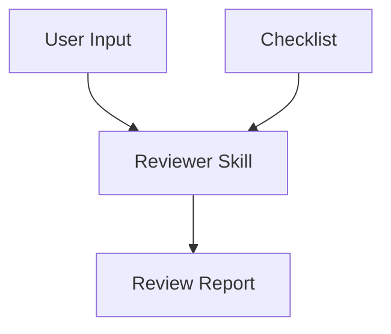
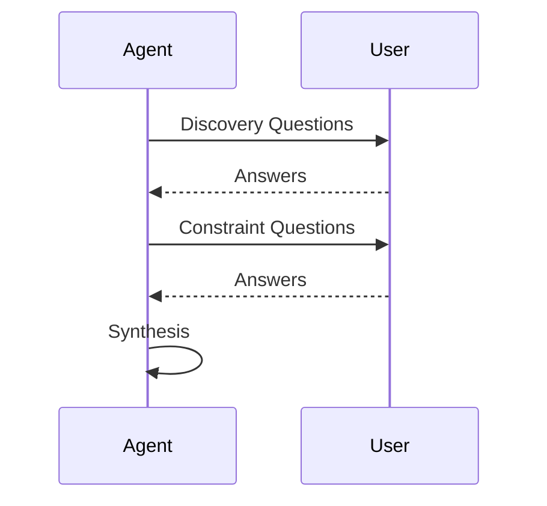
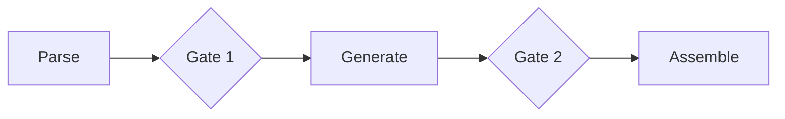

> It's like trying to impose *semantic structure* on what is fundamentally a bag of side effects.

# Agent Skill Design Patterns

## 1. Tool Wrapper

Teaches the agent a library by applying pure knowledge rather than scripts or templates. The agent acts as a domain expert, applying best practices and rules directly from the documentation.

### Key Components

* **SKILL.md**: Review and write instructions.
* **references/conventions.md**: Contains best practices and rules.

### Diagram

## 2. Generator

Produces structured output (reports, docs, or configs) based on predefined templates and quality standards.

### Key Components

* **SKILL.md**: Instructions on how to write.
* **references/style-guide.md**: Defines tone and formatting.
* **assets/report-template.md**: Defines the output structure.

### Diagram

## 3. Reviewer

Evaluates user input (such as code) against a specific set of standards or checklists to produce a detailed findings report.

### Key Components

* **SKILL.md**: Defines the review protocol (Load, Apply, Report).
* **references/review-checklist.md**: Contains rules categorized by severity.

### Diagram

## 4. Inversion

The skill drives the conversation by interviewing the user through structured phases before synthesizing a final result.

### Key Components

* **Phase 1: Discovery**: Questions regarding the problem, users, and scale.
* **Phase 2: Constraints**: Questions regarding platform, tech stack, and requirements.
* **Phase 3: Synthesis**: Loading and filling templates based on user answers.

### Diagram

## 5. Pipeline

Enforces a multi-step workflow with mandatory validation gates to ensure quality and user alignment at each stage.

### Key Components

* **Steps**: Parse & Inventory, Generate Docstrings, Assemble Docs, Quality Check.
* **Gates**: Logical checkpoints requiring user confirmation or approval before proceeding.

### Diagram

