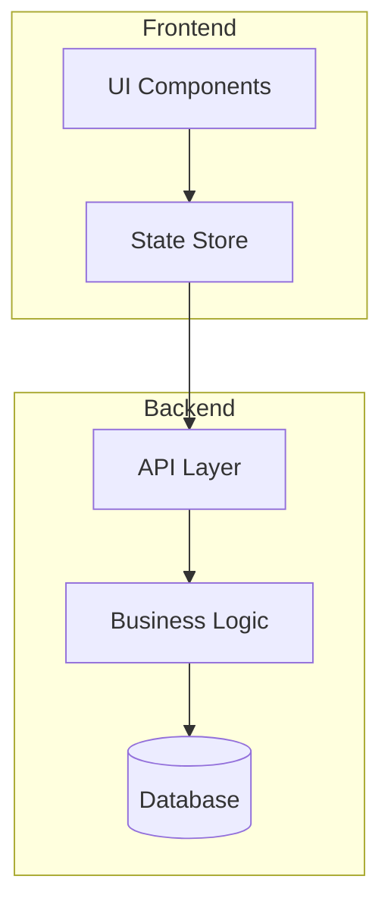
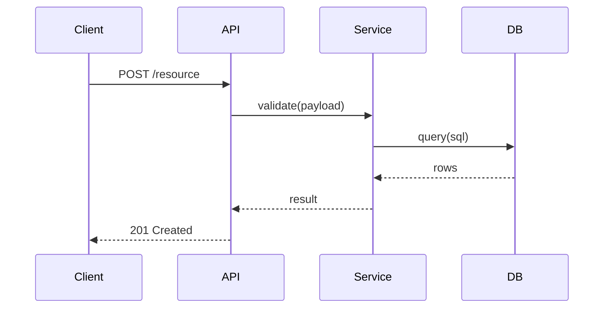
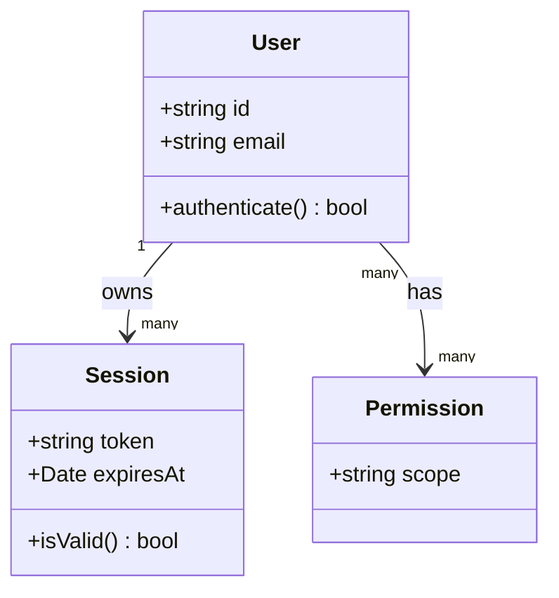
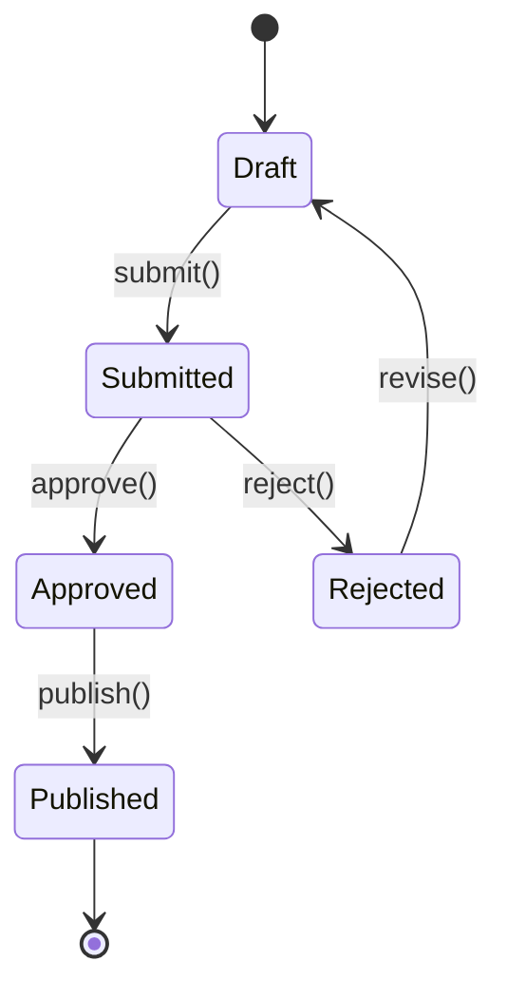
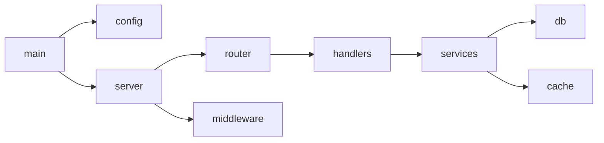
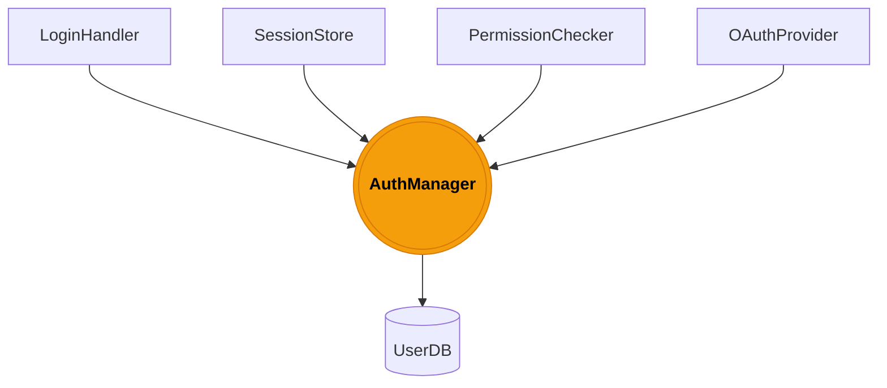
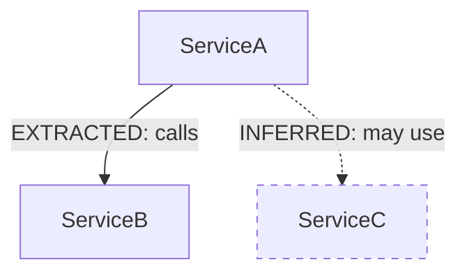

# Mermaid Diagram Patterns for Codebase Documentation

Use these patterns when generating diagrams from a codebase graph. Pick the type
that best matches the structure being described.

---

## Architecture / Layer Diagram

Best for: showing how top-level modules/packages are organized.

Guidance:
- Group related modules in `subgraph` blocks
- Use `[(label)]` for databases/storage
- Keep to ~12 nodes max; split into multiple diagrams if larger
- Label edges with the relationship type (calls, reads, emits, etc.)

---

## Call Flow / Sequence Diagram

Best for: showing how a request or event flows between components.

Guidance:
- Use `-->>` for responses (dashed), `->>` for calls (solid)
- Add `Note over X,Y: text` for important decisions
- Keep to one happy path per diagram; add alt blocks for errors

---

## Class / Data Model Diagram

Best for: showing entity relationships, class hierarchies, interfaces.

Guidance:
- Use `+` for public, `-` for private members
- Show cardinality on associations
- Group related classes; omit getters/setters

---

## State Machine Diagram

Best for: lifecycle states of an entity (order, job, document, etc.).

---

## Dependency Graph (simplified)

Best for: showing which modules import/depend on which others.

Guidance:
- Direction LR (left→right) works better than TD for dependency trees
- Bold or highlight "god nodes" (highest-degree nodes)
- Use `:::highlight` with a CSS class if rendering supports it

---

## God Node Pattern

When the graph report identifies highly-connected nodes, emphasize them:

---

## Confidence Indicators

graphify tags relationships as EXTRACTED, INFERRED, or AMBIGUOUS.
Reflect this in diagrams:

- Solid lines → EXTRACTED (directly found in code)
- Dashed lines (`-.->`) → INFERRED or AMBIGUOUS

---

## Tips for Beautiful Diagrams

1. **Use subgraphs** to create visual layers — don't put everything at top level
2. **Limit nodes** — 8–15 nodes per diagram is optimal for readability
3. **Edge labels** should be verbs: "calls", "emits", "reads", "extends"
4. **Direction**: TD (top-down) for hierarchies, LR (left-right) for pipelines/flows
5. **Multiple diagrams** beat one mega-diagram — one per architectural concern
6. **Consistent naming** — use the same node IDs across diagrams to imply continuity
